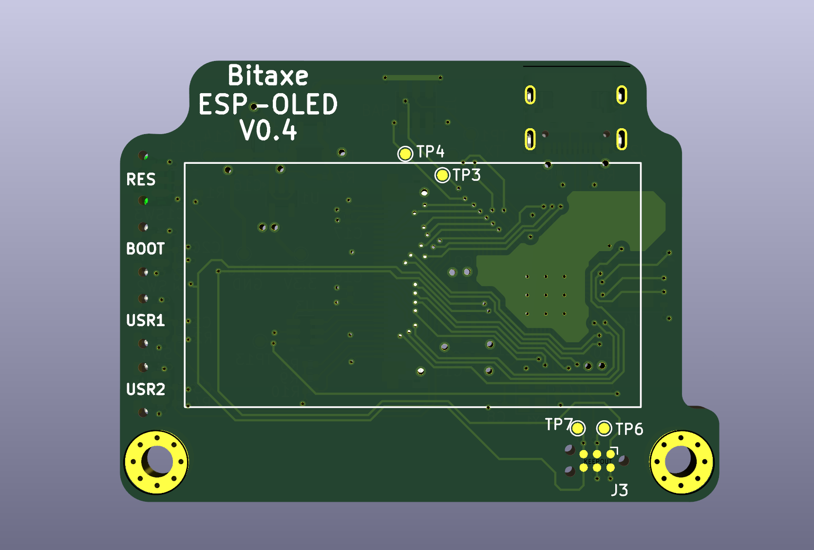
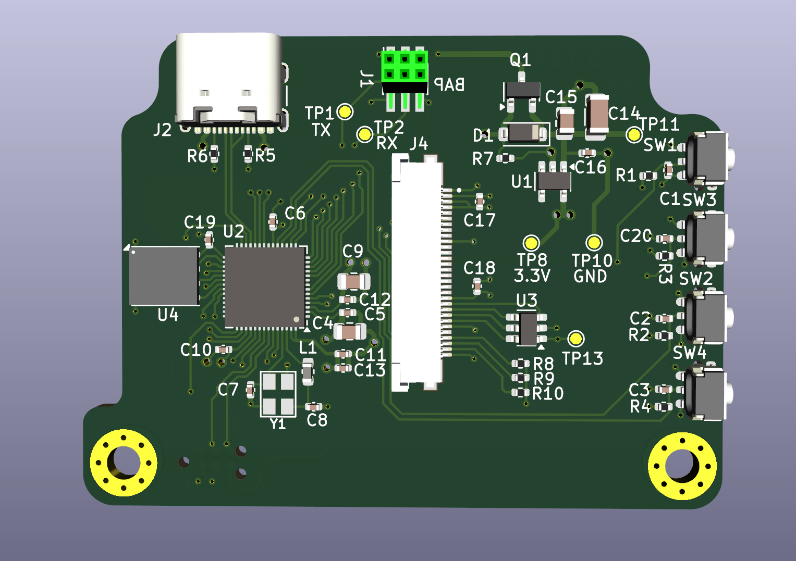

# bitaxe-ESP-OLED
bitaxe-ESP-OLED is a carrier board for a specific 1.9 inch 170x320 OLED
which is intended to connect to a bitaxe device via the BAP (Bitaxe Accessory Port)
The carrier board contains an ESP32-S3 MCU that drives the display and receives 
status info via UART using the BAP (Bitaxe Accessory Port)

Here is the OLED display

The display attaches to the front of the carrier board using double sided foam tape, and 
the connector wraps around through the notch and attaches to the 30-pin connector on the back.

This OLED display uses a ST7789 controller operates in parallel mode through its 30-pin connector.  
The carrier board uses an ESP32-S3 MCU to drive the OLED.

There are two user buttons on the front of the board used for navigating the GUI.

The MCU firmware will display various GUI pages, and the data for these pages will be 
supplied by the bitaxe through the UART.

